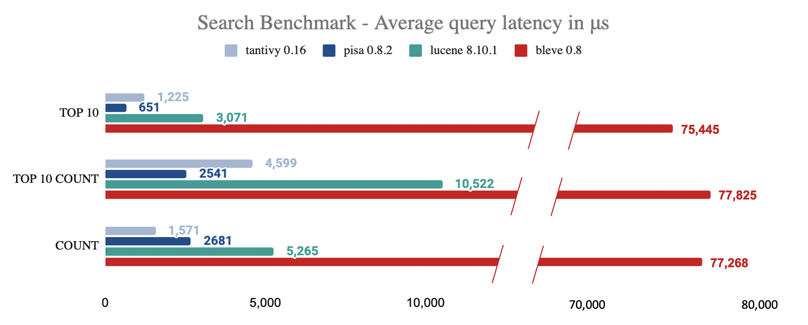

[](https://docs.rs/crate/tantivy/)
[](https://github.com/quickwit-oss/tantivy/actions/workflows/test.yml)
[](https://codecov.io/gh/quickwit-oss/tantivy)
[](https://discord.gg/MT27AG5EVE)
[](https://opensource.org/licenses/MIT)
[](https://crates.io/crates/tantivy)


**Tantivy** is a **full-text search engine library** written in Rust.

It is closer to [Apache Lucene](https://lucene.apache.org/) than to [Elasticsearch](https://www.elastic.co/products/elasticsearch) or [Apache Solr](https://lucene.apache.org/solr/) in the sense it is not
an off-the-shelf search engine server, but rather a crate that can be used
to build such a search engine.

Tantivy is, in fact, strongly inspired by Lucene's design.

If you are looking for an alternative to Elasticsearch or Apache Solr, check out [Quickwit](https://github.com/quickwit-oss/quickwit), our search engine built on top of Tantivy.

# Benchmark

The following [benchmark](https://tantivy-search.github.io/bench/) breakdowns
performance for different types of queries/collections.

Your mileage WILL vary depending on the nature of queries and their load.



Details about the benchmark can be found at this [repository](https://github.com/quickwit-oss/search-benchmark-game).

# Features

- Full-text search
- Configurable tokenizer (stemming available for 17 Latin languages) with third party support for Chinese ([tantivy-jieba](https://crates.io/crates/tantivy-jieba) and [cang-jie](https://crates.io/crates/cang-jie)), Japanese ([lindera](https://github.com/lindera-morphology/lindera-tantivy), [Vaporetto](https://crates.io/crates/vaporetto_tantivy), and [tantivy-tokenizer-tiny-segmenter](https://crates.io/crates/tantivy-tokenizer-tiny-segmenter)) and Korean ([lindera](https://github.com/lindera-morphology/lindera-tantivy) + [lindera-ko-dic-builder](https://github.com/lindera-morphology/lindera-ko-dic-builder))
- Fast (check out the :racehorse: :sparkles: [benchmark](https://tantivy-search.github.io/bench/) :sparkles: :racehorse:)
- Tiny startup time (<10ms), perfect for command-line tools
- BM25 scoring (the same as Lucene)
- Natural query language (e.g. `(michael AND jackson) OR "king of pop"`)
- Phrase queries search (e.g. `"michael jackson"`)
- Incremental indexing
- Multithreaded indexing (indexing English Wikipedia takes < 3 minutes on my desktop)
- Mmap directory
- SIMD integer compression when the platform/CPU includes the SSE2 instruction set
- Single valued and multivalued u64, i64, and f64 fast fields (equivalent of doc values in Lucene)
- `&[u8]` fast fields
- Text, i64, u64, f64, dates, ip, bool, and hierarchical facet fields
- Compressed document store (LZ4, Zstd, None)
- Range queries
- Faceted search
- Configurable indexing (optional term frequency and position indexing)
- JSON Field
- Aggregation Collector: histogram, range buckets, average, and stats metrics
- LogMergePolicy with deletes
- Searcher Warmer API
- Cheesy logo with a horse

## Non-features

Distributed search is out of the scope of Tantivy, but if you are looking for this feature, check out [Quickwit](https://github.com/quickwit-oss/quickwit/).

# Getting started

Tantivy works on stable Rust and supports Linux, macOS, and Windows.

- [Tantivy's simple search example](https://tantivy-search.github.io/examples/basic_search.html)
- [tantivy-cli and its tutorial](https://github.com/quickwit-oss/tantivy-cli) - `tantivy-cli` is an actual command-line interface that makes it easy for you to create a search engine,
index documents, and search via the CLI or a small server with a REST API.
It walks you through getting a Wikipedia search engine up and running in a few minutes.
- [Reference doc for the last released version](https://docs.rs/tantivy/)

# How can I support this project?

There are many ways to support this project.

- Use Tantivy and tell us about your experience on [Discord](https://discord.gg/MT27AG5EVE) or by email (paul.masurel@gmail.com)
- Report bugs
- Write a blog post
- Help with documentation by asking questions or submitting PRs
- Contribute code (you can join [our Discord server](https://discord.gg/MT27AG5EVE))
- Talk about Tantivy around you

# Contributing code

We use the GitHub Pull Request workflow: reference a GitHub ticket and/or include a comprehensive commit message when opening a PR.
Feel free to update CHANGELOG.md with your contribution.

## Tokenizer

When implementing a tokenizer for tantivy depend on the `tantivy-tokenizer-api` crate.

## Clone and build locally

Tantivy compiles on stable Rust.
To check out and run tests, you can simply run:

```bash
git clone https://github.com/quickwit-oss/tantivy.git
cd tantivy
cargo test
```

# Companies Using Tantivy

<p align="left">
&nbsp;
 &nbsp;


 &nbsp;
&nbsp; &nbsp;

</p>

# FAQ

### Can I use Tantivy in other languages?

- Python → [tantivy-py](https://github.com/quickwit-oss/tantivy-py)
- Ruby → [tantiny](https://github.com/baygeldin/tantiny)

You can also find other bindings on [GitHub](https://github.com/search?q=tantivy) but they may be less maintained.

### What are some examples of Tantivy use?

- [seshat](https://github.com/matrix-org/seshat/): A matrix message database/indexer
- [tantiny](https://github.com/baygeldin/tantiny): Tiny full-text search for Ruby
- [lnx](https://github.com/lnx-search/lnx): adaptable, typo tolerant search engine with a REST API
- and [more](https://github.com/search?q=tantivy)!

### On average, how much faster is Tantivy compared to Lucene?

- According to our [search latency benchmark](https://tantivy-search.github.io/bench/), Tantivy is approximately 2x faster than Lucene.

### Does tantivy support incremental indexing?

- Yes.

### How can I edit documents?

- Data in tantivy is immutable. To edit a document, the document needs to be deleted and reindexed.

### When will my documents be searchable during indexing?

- Documents will be searchable after a `commit` is called on an `IndexWriter`. Existing `IndexReader`s will also need to be reloaded in order to reflect the changes. Finally, changes are only visible to newly acquired `Searcher`.
